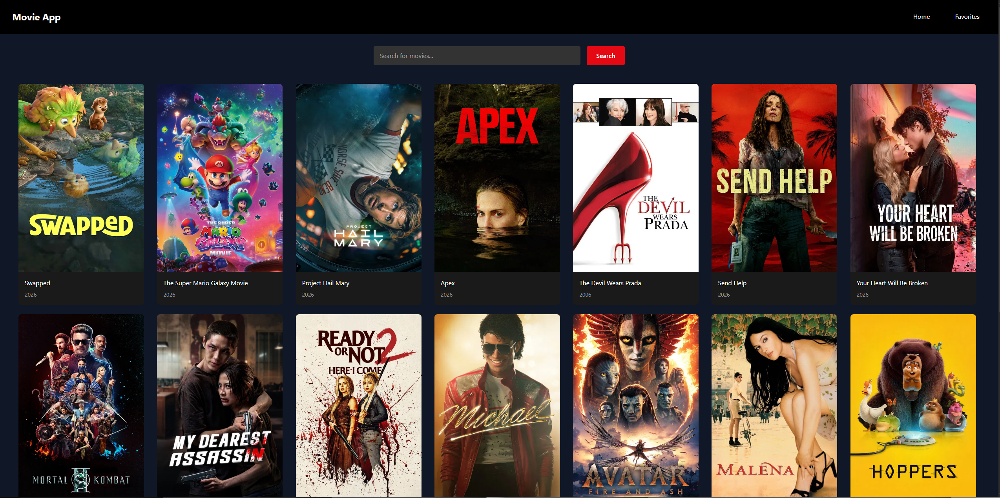

# 🎬 Movie App

Aplicação web desenvolvida com React e TypeScript que consome a API do TMDB para exibir filmes populares e permitir o gerenciamento de favoritos.

O projeto foi criado com foco em praticar conceitos modernos de front-end, como componentização, gerenciamento de estado com Context API, consumo de APIs e estilização com Tailwind CSS.

---

## 🌐 Deploy

🔗 [Movie App](https://movie-app-psi-rose-26.vercel.app/)

## 🚀 Tecnologias utilizadas

-  **React**
-  **TypeScript**
-  **Vite**
-  **Tailwind CSS**
-  **React Router DOM**
- ⚛️ **Context API**
- 🎬 **TMDB API**
- 💾 **LocalStorage**

---

## ✨ Funcionalidades

### 1. 🔍 Página de Busca

- Busca na barra de pesquisa
- Pesquisa de filmes utilizando a API do TMDB
- Exibição da lista de resultados com:
  - Pôster
  - Título
  - Data de lançamento

### 2. ❤️ Lista de favoritos

- Adicionar e remover filmes dos favoritos
- Persistência de dados com LocalStorage
- Página dedicada para filmes favoritados

### 3. 📱 Interface responsiva

- Layout adaptado para desktop e dispositivos móveis

### 4. 🔄 Navegação SPA

- Navegação entre páginas utilizando React Router

### 5. ⚠️ Tratamento de Erros & Loading

- Loading durante requisições da API
- Tratamento de erros em buscas e carregamento de filmes
- Mensagens para estados vazios

---

## 📸 Preview



---

## 📦 Como executar o projeto

```bash
# Clone o repositório
git clone https://github.com/seu-usuario/movie-app.git

# Entre na pasta do projeto
cd movie-app

# Instale as dependências
npm install

# Inicie o servidor de desenvolvimento
npm run dev
```
